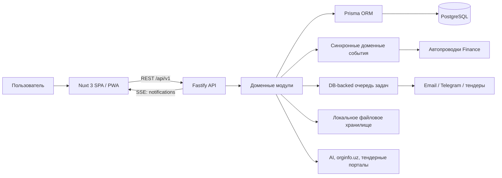

# TTR ONE — обзор проекта

> Срез состояния на 3 августа 2026 года. Обзор составлен по исходному коду, Prisma-схеме и миграциям, Nuxt-клиенту, тестам, CI и deployment-файлам. Значения из локального `.env` не использовались и здесь не приводятся.

## 1. Что это за система

TTR ONE — мультитенантная ERP-платформа для компаний, прежде всего ориентированная на рынок Узбекистана: базовая валюта и тарифы — UZS, поддерживается НДС, есть банковские реквизиты, поиск организации по ИНН и адаптеры узбекских тендерных площадок.

Продукт задуман как конструктор: при регистрации компания выбирает отрасль, тариф и набор модулей, а система создает отдельного арендатора (`tenant`) с владельцем, ролями, основной компанией, складом и единицами измерения. В интерфейсе остаются только разрешенные пользователю и включенные для компании разделы.

Фактически это уже не описанный в корневом `README.md` «foundation MVP», а широкая ERP:

- 12 подключаемых бизнес-модулей плюс базовые организационные и платформенные функции;
- 25 backend-контекстов в `src/modules` и примерно 360 REST-операций;
- 100 Prisma-моделей и 27 миграций PostgreSQL;
- 73 Nuxt-страницы;
- 117 интеграционных тестов в 22 файлах.

Архитектурно это модульный монолит: один Fastify-процесс, один Nuxt SPA-клиент и одна общая PostgreSQL-схема. Границы модулей видны в структуре каталогов и правах доступа, но это не набор независимо развертываемых микросервисов.

## 2. Общая архитектура



Основные части:

| Часть | Технологии и роль | Главные файлы |
|---|---|---|
| API | Node.js, TypeScript, Fastify 5, Zod; сборка приложения, security hooks, единый формат ошибок, REST API | `src/server.ts`, `src/app.ts`, `src/config.ts` |
| Бизнес-логика | Один `routes.ts` на bounded context; обработчики обычно совмещают валидацию, Prisma-запросы и переходы состояний | `src/modules/*/routes.ts` |
| Общие доменные примитивы | Остатки, резервы, себестоимость, бухгалтерский журнал, события, аудит, уведомления, фоновые задачи | `src/lib/*` |
| Данные | PostgreSQL через один Prisma Client; локально может автоматически запускаться embedded PostgreSQL | `prisma/schema.prisma`, `prisma/migrations`, `src/db.ts`, `src/pg.ts` |
| Web | Nuxt 3 в режиме SPA (`ssr: false`), Vue 3, Pinia, адаптивные layouts, PWA | `web/nuxt.config.ts`, `web/pages`, `web/stores`, `web/layouts` |
| Legacy UI | Старый vanilla-JS интерфейс, который Fastify все еще раздает как static fallback | `public/` |
| Эксплуатация | Docker Compose, отдельные API/Web-образы, raw Kubernetes и Helm, GitHub Actions | `Dockerfile`, `web/Dockerfile`, `docker-compose.yml`, `deploy/`, `.github/workflows/ci.yml` |

### Как проходит обычный запрос

1. Nuxt-клиент вызывает `/api/v1/...` и передает access JWT в `Authorization: Bearer ...`.
2. Fastify проверяет JWT и не принимает customer-portal token во внутреннем API.
3. Route guard проверяет permission code; доменный обработчик берет `tenantId` только из подписанного токена.
4. Входные данные валидируются Zod-схемой, затем обработчик работает через Prisma.
5. Сложные операции обычно выполняются в транзакции. Межмодульные списания/приходы в основном проходят через общий stock primitive, а финансовые события могут в той же транзакции создать проводки. Ручные складские движения и transfer пока содержат отдельную реализацию.
6. Клиент получает единый error envelope либо JSON-результат. На ответ также ставится `x-request-id`.

## 3. Функциональные области

| Область | Что реализовано | Backend / основные экраны |
|---|---|---|
| Tenant и onboarding | Саморегистрация, отраслевые пресеты, выбор тарифа и модулей, white-label, квоты | `auth`, `tenant`, `billing`; `/register`, `/settings`, `/billing` |
| Доступ и безопасность | Пользователи, приглашения, 11 системных ролей, custom roles, 49 permissions, аудит, MFA TOTP, PIN, сессии | `auth`, `admin`; `/users`, `/roles`, `/audit` |
| Организация | Компании, филиалы, департаменты и должности | `org`; `/companies`, `/hr-structure` |
| Каталог | Единицы, категории, товары, SKU и штрихкоды, цены и прайс-листы | `catalog`, часть `sales`; `/products`, `/categories`, `/price-lists` |
| Склад / WMS | Склады, остатки и резерв, append-only через текущий API movement ledger, перемещения, иерархия локаций, ячейки, партии, серийные номера, инвентаризация, min/max остатки | `warehouse`, `inventory`; `/inventory`, `/movements`, `/warehouses`, `/stock-count`, `/batches`, `/reorder`, `/m` |
| Закупки | Поставщики и их цены, заявки и согласование, purchase orders, частичная приемка, GRN, счета поставщиков, 3-way match | `procurement`; `/suppliers`, `/purchase-requests`, `/purchase-orders`, `/supplier-invoices` |
| MRP и тендеры | Расчет дефицита из спроса/остатка/резерва/заказов, создание заявки; загрузка публичных тендеров | `mrp`, `platform`; `/mrp`, `/tenders` |
| Продажи | Клиенты и контакты, предложения, заказы, резервирование, частичные отгрузки, возвраты, прайс-листы | `sales`; `/customers`, `/quotations`, `/sales-orders`, `/shipments` |
| CRM и портал клиента | Сделки и воронка; отдельный customer auth realm с доступом только к данным своего клиента | `crm`, `portal`; `/deals`, `/portal/*` |
| Производство | BOM, производственные заказы, проверка доступности, списание материалов, выпуск продукции, рабочие центры, маршруты, операции и ОТК | `production`; `/boms`, `/production-orders`, `/production-routing`, `/work-centers` |
| Финансы | Кассы и банк, операции, двойная запись, план счетов, периоды, сторнирование, FIFO/average costing, НДС, сверка, бюджеты, платежный календарь и отчеты | `finance`; `/fin-accounts`, `/cash-transactions`, `/chart-of-accounts`, `/journal`, `/accounting-periods`, `/vat`, `/bank-reconciliation`, `/budgets`, `/payment-calendar`, `/finance-reports` |
| HR и зарплата | Сотрудники, оргструктура, отпуска, табель, payroll lifecycle, выплата и связанная проводка | `hr`; `/employees`, `/leaves`, `/timesheet`, `/payroll` |
| POS | Кассы, смены, продажи, разделение наличных/карты, возвраты, X/Z-подобная отчетность | `pos`; `/pos-terminal`, `/pos-shifts`, `/pos-registers`, `/pos-report` |
| Проекты | Проекты, этапы, задачи, статусы, таймшиты и стоимость труда | `projects`; `/projects`, `/projects/[id]` |
| Логистика | Автопарк, рейсы, точки маршрута, dispatch/complete/cancel и сводка | `logistics`; `/logistics-vehicles`, `/deliveries` |
| Документооборот | Шаблоны, подстановка полей, версии, последовательное согласование, подпись/отказ, импорт DOCX и HTML-sanitization | `documents`; `/documents` |
| BI и AI | KPI, временные ряды, отчеты CSV/XLSX, ABC/оборачиваемость, прогноз спроса, read-only AI-ответы по snapshot и OCR накладной | `analytics`, `ai`; `/analytics`, `/reports`, `/forecast`, `/abc-analysis`, `/ai-assistant` |
| Studio и platform services | Конструктор форм, записи, marketplace, credentials интеграций, поиск, уведомления, файлы, SSE, jobs | `studio`, `platform`; `/forms`, `/marketplace`, `/integrations`, `/jobs` |
| Super-admin | Управление арендаторами и тарифами, подтверждение банковских платежей, реквизиты продавца, вызов Didox | `superadmin`; `/platform` |

## 4. Главные сквозные процессы

### Регистрация компании

`POST /auth/register` передает управление в `src/lib/provision.ts`:

1. проверяются тариф и лимит выбранных модулей;
2. создается tenant с 14-дневным trial;
3. создаются системные роли и связи с глобальным каталогом permissions;
4. создается owner;
5. создаются основная компания, основной склад и базовые единицы измерения;
6. сохраняется состояние всех подключаемых модулей;
7. выдаются access JWT и rotating refresh token.

Важная деталь: provisioning сейчас состоит из последовательных Prisma-операций, а не обернут целиком в одну транзакцию. Ошибка в середине может оставить частично созданного арендатора.

### Закупка до прихода на склад

```text
Заявка → согласование → заказ поставщику → отправка → приемка (GRN)
       → StockItem + StockMovement(RECEIPT) → себестоимость/FIFO layer
       → при включенном Finance: Дт Запасы/НДС, Кт Поставщик
       → счет поставщика → 3-way match → отметка оплаты
```

Приемка поддерживает частичные количества. Остаток меняется через `src/lib/stock.ts`, а проводка создается синхронным domain event внутри той же DB-транзакции.

### Продажа до отгрузки и возврата

```text
Предложение → принято → заказ → подтверждение → резерв
            → частичная/полная отгрузка → OUT со склада
            → выручка + НДС + COGS в журнале
            → возврат → IN на склад + обратные проводки
```

Доступное количество считается как `onHand - reserved`. Путь резервирования не дает зарезервировать больше доступного, а стандартные ручные складские операции отдельно проверяют остаток. Однако сам общий `applyStockDelta` не запрещает отрицательный итог; endpoint отгрузки позволяет вызвать shipment без обязательного предварительного reserve. Это один из рисков целостности, отмеченных ниже.

### Производственный цикл

```text
BOM → производственный заказ → confirm → проверка материалов
    → issue материалов (OUT, стоимость уходит в WIP)
    → маршрут/операции/ОТК
    → complete готовой продукции (IN, WIP превращается в запас)
```

Можно частично выпускать готовую продукцию. Себестоимость материалов накапливается в заказе. Операции рабочих центров отдельно рассчитывают `costMinor`, но текущая оценка выпуска использует только material cost и не включает эту стоимость операций; ОТК фиксирует годное количество и брак.

### Другие финансовые связи

Синхронные автопроводки также есть для POS-продажи/возврата и начисления зарплаты. Бухгалтерский журнал задуман как неизменяемый: опубликованную запись исправляют сторно, а не редактированием.

## 5. Данные и инварианты

- База — PostgreSQL. Комментарии в начале `prisma/schema.prisma` про SQLite уже устарели; фактический provider — `postgresql`.
- Большинство корневых бизнес-сущностей содержит `tenantId`; дочерние строки иногда получают tenant scope только через родителя.
- Мультитенантность обеспечивается приложением: каждый handler должен явно добавить фильтр `tenantId`. PostgreSQL Row-Level Security и общий Prisma tenant middleware отсутствуют.
- Деньги хранятся целыми minor units (для UZS — тийины): часть полей имеет тип `Int`, крупные суммы и агрегаты — `BigInt`. Float для денег валидаторы не принимают.
- Количества хранятся как Prisma `Decimal`; валидаторы ограничивают знак, диапазон и число знаков после запятой.
- Статусы и типы в основном представлены строками, а не database enums; допустимые переходы проверяются в route code через Zod и явные условия.
- `StockMovement` служит журналом движения с `balanceAfter`; для себестоимости используются running average и FIFO layers.
- Финансовая запись должна быть сбалансирована, связана с периодом и после posting меняется только через reversal.
- Для части документов используется атомарный `NumberSequence` из `src/lib/ledger.ts`, но ряд модулей все еще формирует номер через `count() + 1`; при параллельном создании там возможен unique conflict.

## 6. Аутентификация, права и защита

Реализованный контур:

- access JWT по умолчанию на 15 минут;
- opaque refresh tokens на 30 дней, в БД хранится SHA-256 hash, токен одноразово ротируется;
- runtime password helper использует `bcryptjs` с cost 12; demo seed местами по-прежнему создает hash с cost 10 напрямую;
- TOTP MFA, password reset, приглашения, список устройств/сессий и revoke;
- отдельный тип JWT для клиентского портала, который внутренний auth plugin отвергает;
- RBAC с 49 granular permissions и custom roles;
- warehouse-level scope для отдельных пользователей и field-level masking цен в части endpoints;
- subscription write-gate: неактивный tenant может читать, но большинство доменных mutation блокируется с HTTP 402;
- best-effort аудит многих чувствительных действий, Helmet, production CORS allowlist, auth/global rate limits, request correlation id;
- production startup отказывается работать со слабыми секретами, пустым CORS allowlist и demo-паролем администратора.

В Nuxt-клиенте токены в холодном состоянии хранятся в `localStorage` только в AES-GCM vault, ключ выводится из PIN через PBKDF2. На время активной вкладки токены и рабочий ключ находятся в памяти/`sessionStorage`; после пяти минут бездействия или ручной блокировки warm session очищается.

Что важно учитывать:

- tenant isolation держится на дисциплине каждого запроса, без защиты на уровне БД;
- `UserWarehouse` сейчас полноценно учитывается главным образом в `warehouse/routes.ts`; inventory, procurement, sales, production и POS не применяют его как общий сквозной guard;
- permissions зашиты в JWT и могут оставаться действующими до обновления/истечения access token;
- включение/выключение бизнес-модуля строго фильтрует Nuxt-навигацию и квоту тарифа, но общего backend guard, запрещающего API выключенного модуля, нет;
- SSE получает access token в query string из-за ограничения native `EventSource`; этот endpoint проверяет только подпись, не отвергает явно customer-token realm и не перечитывает актуальный status пользователя;
- Fastify CSP оставляет `unsafe-inline` для legacy static UI; активная Nuxt-сессия остается чувствительна к XSS;
- TOTP не имеет recovery codes и server-side защиты от повторного использования того же кода в допустимом временном окне;
- customer portal хранит свой 12-часовой bearer token открытым в `localStorage`, без refresh/PIN vault; это отдельная, более простая модель безопасности.
- аудит подавляет ошибки записи и вызван не во всех mutation, поэтому `AuditLog` пока нельзя считать полным compliance-журналом.
- platform files не имеют отдельного permission/ACL: любой внутренний authenticated user может list/upload/download/delete все attachments своего tenant независимо от `refType/refId`.

Подробный статический разбор уже есть в `docs/SECURITY.md`; в его конце перечислены примененные исправления и оставшиеся пункты.

## 7. Frontend и пользовательский опыт

Основной интерфейс — Nuxt 3 SPA. В нем есть четыре layout-контекста:

- `default` — landing, вход, регистрация и приглашение;
- `app` — основной ERP shell с sidebar, topbar, поиском, уведомлениями и white-label;
- `mobile` — интерфейс мобильного кладовщика;
- `portal` — отдельный кабинет покупателя.

Pinia store `web/stores/auth.ts` отвечает не только за login/logout, но и за refresh concurrency, crypto vault, загрузку tenant/settings/subscription и API wrapper. Навигация из `web/composables/useViews.ts` фильтруется одновременно по permission, enabled module и platform-admin flag.

Отдельные возможности клиента:

- адаптивная боковая навигация и mobile drawer;
- глобальный поиск и realtime-уведомления по SSE;
- white-label название и accent color на tenant;
- легковесная локализация RU/UZ/EN для shell/nav и части landing/login/core pages; регистрация, портал и большинство глубоких экранов остаются hard-coded Russian, а числа/даты всегда форматируются как `ru-RU`/UZS;
- PWA с network-first service worker;
- мобильный сканер через browser `BarcodeDetector`, ручной fallback и offline outbox в IndexedDB;
- offline queue только для складских IN/OUT/ADJUST на `/m`; lookup и остальная ERP требуют API, replay идет кнопкой или foreground-событием `online`, без Service Worker Background Sync;
- service worker содержит receiving-side Web Push handlers, но permission/subscription flow и install-prompt UI еще не подключены;
- отдельный portal token и отдельный API wrapper для customer portal.

`public/` — предыдущая vanilla SPA. Она остается запасным static UI для запуска только API, но production deployment направляет обычный web-трафик на отдельный Nuxt/nginx-контейнер. В legacy UI внутренние access/refresh tokens лежат открыто в `localStorage`; его PIN показывает lock overlay, но не использует Nuxt crypto vault. Поэтому два frontend имеют разный security posture.

## 8. Платформенные сервисы и интеграции

| Механизм | Текущее состояние |
|---|---|
| Realtime | SSE и in-memory pub/sub; фактически клиент использует его для уведомлений, а не для live-refresh всех доменных таблиц |
| Background jobs | Очередь в PostgreSQL, polling раз в 3 секунды, atomic claim, retry с backoff; без Redis |
| Files | Metadata в БД, bytes в локальном `.storage`; upload как base64 JSON, не multipart/S3 |
| Notifications | Запись в БД + SSE; email/Telegram ставятся в jobs |
| AI | Реальные HTTP-вызовы OpenAI или Anthropic при наличии tenant/env key; ассистент read-only, OCR возвращает распознанные данные для проверки |
| Тендеры | Реальные best-effort адаптеры TenderWeek, UZEX E-Tender и XT-Xarid |
| Поиск по ИНН | Best-effort чтение публичной страницы `orginfo.uz` |
| Платежи | Банковский счет и ручное подтверждение реализованы; card/mock — sandbox, Payme/Click/Stripe не подключены |
| Didox | Только интерфейс/stub; даже с env credentials реальная отправка ЭСФ не реализована |
| SMTP / Telegram | Stub: код логирует отправку; реального SMTP/Bot API вызова пока нет |
| Integration credentials | Хранятся зашифрованными AES-256-GCM на tenant, API не возвращает секреты обратно |

## 9. Запуск и эксплуатация

### Локальная разработка

API и современный UI запускаются отдельно:

Сначала нужен development `.env` как минимум с `DATABASE_URL` и `JWT_SECRET`. Важно: корневой `.env.example` рассчитан на Docker Compose и использует hostname `postgres`; для embedded PostgreSQL URL нужно направить на локальный `127.0.0.1:5433` и значения `PG_*` либо их defaults из `src/pg.ts`.

```bash
# Терминал 1, корень проекта
npm install
npm run setup
npm run dev

# Терминал 2
cd web
npm install
npm run dev
```

- API: `http://localhost:3000`;
- Nuxt: `http://localhost:3001`;
- embedded PostgreSQL: порт 5433, данные в `.pgdata`;
- API base клиента меняется через `NUXT_PUBLIC_API_BASE`.

`npm run setup` запускает embedded Postgres, применяет миграции, генерирует Prisma Client и выполняет demo seed. Повторный seed не полностью чистый: он делает upsert большей части demo-данных, но отдельные области сбрасывает, поэтому его не следует направлять на базу с ценными данными.

Текущий корневой `package.json` напрямую включает `@embedded-postgres/windows-x64`, поэтому локальная установка фактически привязана к Windows. На Linux/macOS, а также в Ubuntu CI и Linux Docker builder, эту зависимость нужно сначала убрать либо оформить как корректную optional/platform dependency.

### Production-путь

- Docker Compose: PostgreSQL 16 + API на 3000 + Nuxt/nginx на 8080;
- Kubernetes/Helm: отдельные Deployments, migration initContainer, readiness/liveness и HPA;
- production API не запускает embedded Postgres и использует внешний `DATABASE_URL`;
- миграции применяются через `prisma migrate deploy`;
- `NUXT_PUBLIC_API_BASE` в web-образе задается во время сборки;
- в исходном API существуют `/health`, `/ready`, `/metrics`, `/api-docs` и `/openapi.yaml`. Текущий K8s/Helm ingress наружу маршрутизирует только API/health/ready, а API image не содержит `docs/openapi.yaml`, поэтому metrics/docs в штатном production deployment недоступны или неполны.

В текущих deployment manifests есть дополнительная проблема: production security gate требует безопасный `SEED_ADMIN_PASSWORD`. Compose его не передает, а штатные K8s/Helm secrets, values и инструкция ключ не создают. `envFrom` позволяет добавить его вручную, но точное следование приложенным инструкциям завершит API на старте даже при корректных JWT/CORS secrets.

Для консистентного local backup нужно остановить embedded PostgreSQL. Скрипт предупреждает о работающей БД, но все равно разрешает hot-copy всего `.pgdata`; пользовательские файлы из `.storage` в этот backup не входят. Для production в комментариях рекомендуется `pg_dump -Fc` внешней PostgreSQL.

## 10. Тесты и текущее состояние сборки

Тесты — интеграционные: приложение собирается in-process, запросы выполняются через `Fastify.inject`, файлы запускаются последовательно над одним seeded demo tenant. Проверяются auth, RBAC, tenant isolation, подписка, склад, продажи/производство, финансы и НДС, WMS, отдельные procurement auto-request/MRP paths, platform services, документы, аналитика/AI stub, HR, POS, проекты, логистика, portal и onboarding. Полного supplier → PO → GRN → invoice → 3-way match/pay теста нет.

Сам `npm test` только запускает embedded PostgreSQL, seed и suite; миграции и Prisma Client он не подготавливает. На чистом окружении сначала нужен `npm run setup` — именно так делает CI.

Сильные стороны тестового контура:

- реальные Prisma/PostgreSQL и заранее подготовленная через setup schema, а не mocks;
- много проверок бизнес-переходов и отрицательных сценариев;
- отдельные isolation и RBAC проверки;
- CI workflow настроен на API typecheck/tests и Nuxt production build.

Ограничения:

- нет выделенного unit-test слоя;
- нет browser E2E для Nuxt, visual regression и contract-теста полноты OpenAPI;
- все интеграционные файлы используют общий mutable demo tenant и потому выполняются строго последовательно;
- покрыты ключевые сценарии, но далеко не каждая из примерно 360 операций.

При подготовке этого обзора выполнены успешно:

- `npm run typecheck`;
- `npm run build` в `web/`.

Полный `npm test` намеренно не запускался, поскольку штатный runner повторно seed-ит локальную базу и меняет demo-данные.

## 11. Основные технические риски и несоответствия

### Приоритетные перед production

1. **Tenant isolation не является инфраструктурным инвариантом.** Нужен Prisma extension/middleware и/или PostgreSQL RLS, плюс систематические cross-tenant тесты для всех доменов. Некоторые write paths требуют дополнительной проверки принадлежности связанных ID tenant — особенно межскладской transfer.
2. **Feature flags и record scopes не enforced сквозным guard.** Выключенный модуль в основном скрывается в UI; владелец с сохраненными permissions может вызвать его endpoint напрямую. Аналогично `UserWarehouse` ограничивает не все модули, которые оперируют складом.
3. **Складской primitive не обеспечивает конкурентный инвариант.** `applyStockDelta` делает read → calculation → absolute upsert без row lock/atomic increment и сам не блокирует отрицательный остаток. Параллельные операции могут потерять update, а shipment без reserve — уйти в минус. Ручные movement/transfer дополнительно обходят общий costing path.
4. **Horizontal scaling конфликтует с локальным состоянием.** SSE pub/sub и метрики живут в памяти одного процесса, а файлы лежат на локальном диске pod. При 2–10 API replicas нужны Redis/NATS/Postgres fan-out и S3-совместимое storage либо sticky/shared infrastructure. Для job со статусом `running` также нет lease/reaper после аварии worker.
5. **Production Dockerfile требует исправления.** Он удаляет devDependencies через `npm prune --omit=dev`, хотя runtime и migration command вызывают `tsx` и `prisma`, находящиеся в devDependencies. Дополнительно корневой `package.json` напрямую зависит от Windows-only пакета embedded Postgres, что несовместимо с Linux builder без корректировки зависимостей.
6. **Production manifests и API docs image неполны.** Compose не передает требуемый `SEED_ADMIN_PASSWORD`, а предоставленные K8s/Helm defaults его не создают; `docs/openapi.yaml` не копируется в API image, поэтому `/openapi.yaml` там вернет 404.
7. **Provisioning не атомарен.** Регистрация tenant должна быть целиком транзакционной или иметь надежную компенсацию.
8. **Интеграции имеют разную зрелость.** UI «подключено» не всегда означает реальную доставку/платеж/ЭСФ; stubs должны быть явно обозначены и не возвращать ложный operational success.

### Поддерживаемость и документация

- крупные `routes.ts` содержат HTTP, validation, orchestration и persistence вместе; для дальнейшего роста полезно выделить application/domain services;
- общая схема и прямые cross-domain вызовы через `src/lib` означают, что будущий split на микросервисы потребует явных контрактов и outbox/event delivery, а не только переноса каталогов;
- root `README.md` заметно устарел: неверны масштаб, число тестов, список API, описание схемы и roadmap;
- `docs/API.md` и `docs/openapi.yaml` описывают представительный, но не полный API; новые HR/POS/Projects/Logistics/MRP/Portal области раскрыты неполно;
- OpenAPI содержит 110 path objects и 144 HTTP-операции, то есть существенно меньше реального API; его пока нельзя считать полным machine-readable contract;
- в `deploy/DEPLOYMENT.md` осталась caveat о запуске embedded Postgres в production, хотя `src/server.ts` уже пропускает его при `NODE_ENV=production`;
- `web/README.md` одновременно называет несколько страниц stub-ами и ниже утверждает, что перенос полностью завершен;
- комментарий Prisma-схемы про SQLite не соответствует реальному PostgreSQL provider.
- `.dockerignore` не исключает локальные `.storage/` и `backups/`, поэтому они могут уйти в build context удаленного Docker builder, хотя в final image не копируются.

## 12. Где читать дальше

| Задача | Начать отсюда |
|---|---|
| Понять сборку API | `src/app.ts`, затем `src/server.ts` |
| Понять tenant и регистрацию | `src/modules/auth/routes.ts`, `src/lib/provision.ts`, `src/modules/tenant/routes.ts` |
| Понять роли и ограничения | `src/lib/permissions.ts`, `src/plugins/rbac.ts`, `src/plugins/subscription.ts` |
| Понять складской инвариант | `src/lib/stock.ts`, `src/lib/reservation.ts`, `src/modules/warehouse/routes.ts` |
| Понять автоматическую бухгалтерию | `src/lib/events.ts`, `src/modules/finance/postings.ts`, `src/lib/ledger.ts` |
| Понять модель данных | `prisma/schema.prisma`, затем миграции по стадиям |
| Понять Nuxt shell и доступность экранов | `web/stores/auth.ts`, `web/composables/useViews.ts`, `web/layouts/app.vue` |
| Понять PWA/mobile | `web/pages/m/index.vue`, `web/utils/outbox.ts`, `web/public/sw.js` |
| Понять эксплуатацию | `deploy/DEPLOYMENT.md`, `docker-compose.yml`, `deploy/helm/ttr-one` |
| Понять ожидаемое поведение | `test/*.test.ts`, `docs/USER-GUIDE.md` |
| Понять security posture | `docs/SECURITY.md` |

## Итоговое понимание

TTR ONE — функционально насыщенный ERP-монолит с хорошим для ранней стадии набором механизмов: tenant scoping, RBAC, строгие деньги/количества, складской ledger и резервы, себестоимость, двойная запись, аудит и множество интеграционных тестов. Сильнейшая сторона проекта — уже связанные end-to-end процессы, а не набор изолированных CRUD-экранов.

Главный следующий рубеж — не добавление очередного модуля, а production hardening: сделать tenant isolation и module flags системными инвариантами, исправить контейнерную сборку, вынести локальное realtime/storage состояние для горизонтального масштаба, довести stubs до реальных интеграций и синхронизировать документацию с фактическим кодом.
